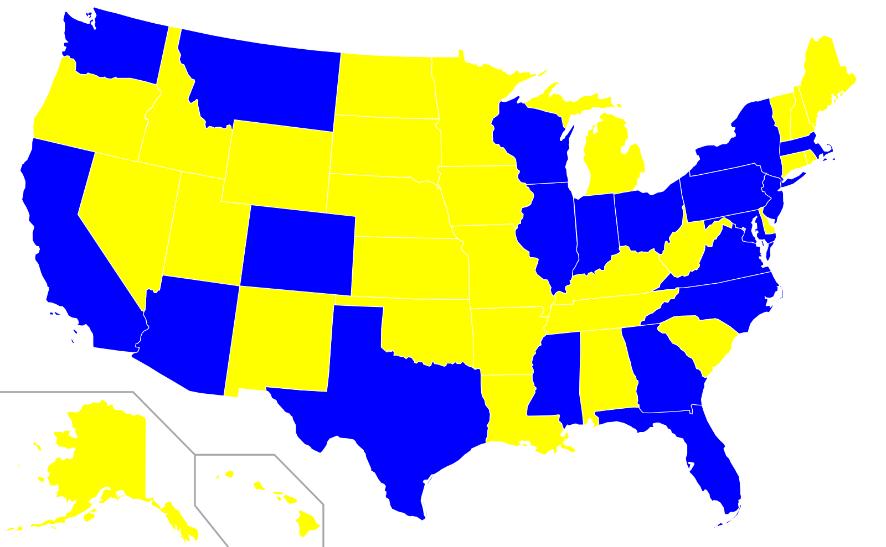

map_editor
==========

This is very early version of map editor. This tool allows editing of SVG maps based on different criteria.

This is a web application that allows users (after they create accounts) to have unlimited number of maps, that they can color. User can have unlimited number of colored (user) maps based on one map.

There are two types of map coloring:
* explicit coloring - use selects and color interactively
* implicit coloring - map is colored based on data set (not implemented yet)

Requirements
------------
* Django (1.6.2)
* South (0.8.4)
* lxml (3.3.0)

Examples
--------

US population by states where states colored in blue are states with population higher then 5,000,000, and states colored with yellow are states that have population less then 5,000,000

